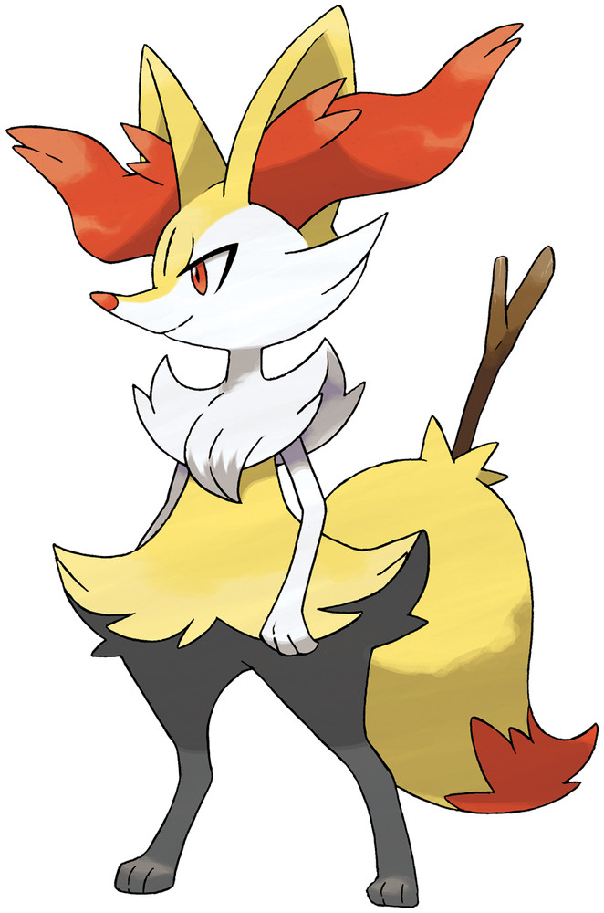

> It has a twig stuck in its tail. With friction from its tail fur, it sets the twig on fire and launches into battle.

## Biology

Braixen is a bipedal, fox-like Pokémon. While the majority of its fur is yellow, it has black legs, white arms and face, and a dark orange tail tip. The fur on its cheeks is longer, and a small mane of white fur covers its shoulders and chest. Long, wavy tufts of dark orange fur grow out of its large ears, and its eyes and small nose match this fur in color. When its mouth is open, two pointed teeth can be seen in its upper jaw. Above its legs, the fur sweeps out to either side, resembling a skirt or shorts. Each paw has three small digits.

Braixen always keeps a stick in its tail, which it sets alight using friction from its bushy tail fur. The flame from the lit twig is used for both attack and communication.