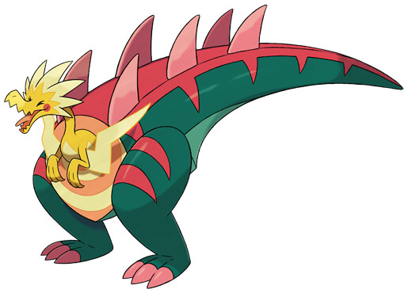

> In ancient times, it was unbeatable thanks to its powerful lower body, but it went extinct anyway after it depleted all its plant-based food sources.

## Biology

Dracozolt is a hybrid fossil Pokémon. It has a small yellow upper body with two long wings shaped like lightning bolts on its arms. Dracozolt has a long neck that connects to a raptor-like head with closed eyes and a red spot on each cheek. The upper half is connected to the middle of the lower body, with an orange and yellow circle surrounding the neck. The lower body is colored pink and green. The legs are green with pink toes and stripes and the tail is green with pink stripes and spikes.

It generates electricity thanks to its powerful tail muscles. It allegedly overate its plant-based food sources, causing it to eventually go extinct, though this is likely not the case due to Dracozolt being combined from two separate Pokémon that each had their niches before going extinct.