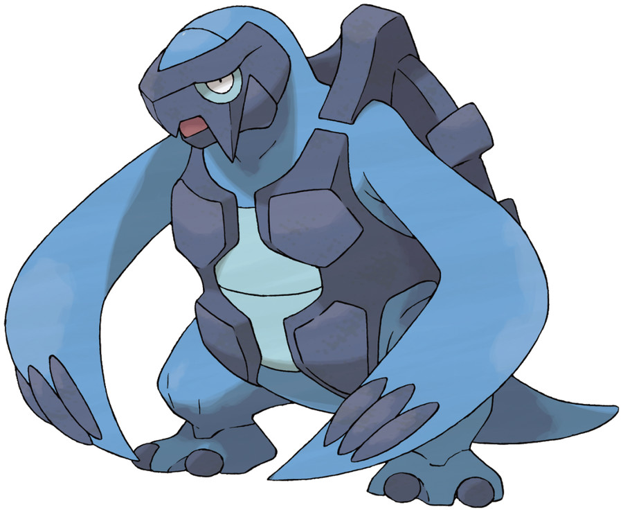

>Carracosta completely devours its prey—bones, shells, and all. Because of this, Carracosta’s own shell grows thick and sturdy.

## Biology

Carracosta is a reptilian Pokémon resembling a bipedal, blue-colored sea turtle. Its stomach is pale blue. It has deep blue rocky structures encrusted on its face, back, and the sides of its chest forming a "mask" and shell. Its flippers are long with black finger-like protrusions at the tips. Carracosta has a thick tail and short legs with two-toed feet.

Carracosta's flippers have enough power to open a hole in the bottom of a tanker with one slap or knock out a foe. It once lived in the sea millions of years ago and is now considered extinct. It hides in its shell to imitate a boulder in order to ambush prey. Carracosta has extremely strong jaws, allowing it to eat steel frames and rocks, in addition to prey, devouring every last piece of flesh and bone. This diet allows Carracosta to develop a thick and sturdy shell. Carracosta is an active hunter on both land and sea. However, it moves slowly on land, so once it finds prey on land, Carracosta drags it into the water to finish it off. It preys on Omanyte and Omastar.