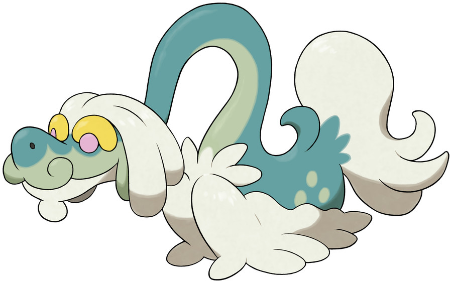

>The mountains it calls home are nearly two miles in height. On rare occasions, it descends to play with the children living in the towns below.

## Biology

Drampa is a serpentine Pokémon similar to a Chinese dragon. Most of its skin is bluish-green, but the lower half of its face and the underside of its neck are a pale green. There are three spots on each of its sides that are also light green. It has pink eyes with rounded, yellow eyebrows, a short mustache, and a small, white beard with a circular extension. On top of its head is a mop of white hair split into four rounded sections: two draped down either side of its head. Fluffy white fur drapes the lower half of its body and conceals its arms when they are tucked against its chest. When its arms are spread, two short claws are revealed on each hand. It has a bushy white tail with a small, curved spike at the base.

This draconic Pokémon lives alone in the mountains 10,000 feet above sea level. The Berries it feeds on do not grow at this altitude, so it descends to the base of the mountains daily at dawn. It loves communicating with people and Pokémon, and is especially gentle with children. It will often appear in areas where children gather and play with them. Despite its gentle nature, it becomes enraged if a child it cares for is hurt, and can go as far as to burn the bully's house down if able.[1] As seen in the anime, Drampa is capable of flying.