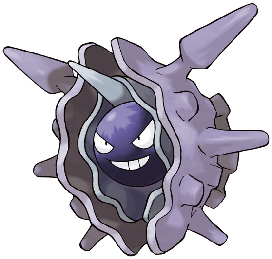

>Its shell is extremely hard. It cannot be shattered, even with a bomb. The shell opens only when it is attacking.

## Biology

Cloyster is a black, pearl-like Pokémon. It is encased inside a light-gray shell, which is surrounded by a second jagged, blue-violet outer shell casing. It has one barb-like spike protruding from above its head, and multiple conical horns on its outer shell. Its shell is harder than diamond with spikes that are even harder; harsh tidal currents will affect the size and sharpness of these spikes. On its pearl-like face, it has two white eyes and a mouth. Aside from its face and head, its internal anatomy has never been seen. Once it has shut itself in, it is impossible to open its shell from the outside. This impressive defense allows it to withstand anything from a bomb blast to even a missile strike.

Cloyster typically only opens its shell to attack an opponent. However, it is fully capable of retaliating against any enemy with its shell tightly closed. With rapid succession, it launches its spikes at the foe, keeping them repelled. It can also attack by clamping onto an enemy with its former signature move, Clamp. The same projectile system it uses to launch its spikes is also used for swimming. It swallows seawater and then ejects it towards the rear propelling it through with siphon-jet propulsion. Being the result of an evolution via Evolution stone, Cloyster is rarely found in the wild, though they can be found in the sea floor, nestled among the rocks and coral, but it will actively hunt on land for Slowpoke tails. Cloyster and its pre-evolved form, Shellder, are relatives of Gastrodon. Kingler is a natural predator of Cloyster.