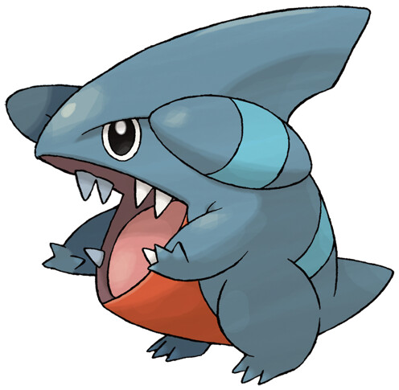

>Gible prefers to stay in narrow holes in the sides of caves heated by geothermal energy. This way, Gible can stay warm even during a blizzard.

## Biology

Gible is a small, bipedal dragon-like Pokémon that is primarily blue. It has a big mouth filled with sharp teeth, no neck, and arms that start at the outer edges of its jaws. A red underbelly stretches from its abdomen to the bottom of its jaw. Gible has two horns that resemble jet or plane engines, each with a light blue stripe in the middle. It has a single light blue stripe wrapping around its back. On top of its head is a dorsal fin, which has a notch on it for the male.

Its dorsal fin is strong enough to carry a person. Gible appears to be a good digger, making deep holes for homes in caverns. It enjoys play-fighting with other members of its species. It has tremendously strong jaws that it uses to bite enemies. However, even while biting, it often hurts itself because of clumsiness. Gible attacks anything that moves by chomping on them. This sometimes causes its teeth to chip and getting injured in the process, but Gible is never bothered by this. Gible drags whatever prey it catches back to its lair. It resides in narrow holes of caves with geothermal heat. This allow Gible to survive even during the winter.