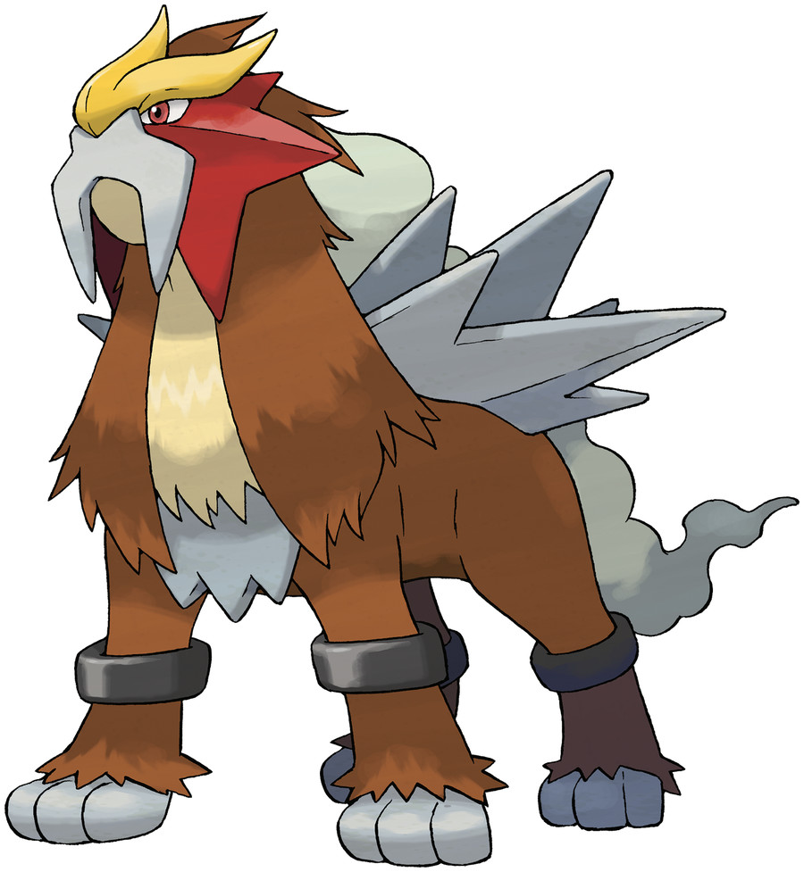

> Entei embodies the passion of magma. This Pokémon is thought to have been born in the eruption of a volcano. It sends up massive bursts of fire that utterly consume all that they touch.

## Biology

Entei is a massive, leonine, quadrupedal Pokémon with some mastiff qualities. It is covered in brown fur and a long, light gray cloud of smoke running along its entire back. It has gray plates on either side of the cloud and a plate beneath the cream belly fur on its chest. Entei has gray paws with brown pads and black cuff-like bands on its legs. Both front paws house three small, white retractable claws, which can be seen in battle or in Pokémon Camp. Its main faceplate is red and shaped like fins or a six-sided star. A gray plate, resembling a horseshoe mustache, covers its muzzle. It also has a yellow crest with three sloped points on its forehead and red eyes. Entei's forehead appears to resemble a kabuto.

An Entei is born whenever a new volcano appears. It is also said that whenever Entei roars, a volcano erupts somewhere in the world. Entei races across grasslands at high speeds. It does this due to being unable to contain its extreme power Entei is said to represent the passion of magma. Entei can unleash massive bursts of fire capable of destroying anything it touches. Entei's fire is said to be hotter than the magma of a volcano.